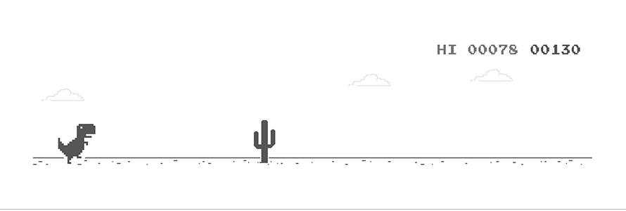

  

<!-- Social Links -->

  &nbsp;
  &nbsp;
  &nbsp;
  

  

---

## 🔮 About Me

<table border="0">
  <tr>
    <td width="30%" align="center" valign="top">
      
    </td>
    <td width="70%" valign="top" style="padding-left: 20px;">
      <h3>RathDev | Full-Stack Software Developer</h3>
      
Hello, I'm RathDev (Sarath Orn), a passionate Full-Stack Software Developer from Cambodia with experience in web development, database management, and software engineering. I enjoy building scalable and efficient applications, exploring new technologies, and solving real-world problems through innovative software solutions.

      
With expertise spanning both front-end and back-end development, I am committed to writing clean, maintainable code and continuously improving my technical skills. My goal is to create impactful digital products that deliver exceptional user experiences and business value.

    </td>
  </tr>
</table>

---

## 🛠️ Tech Universe

  
   
  
   
  &nbsp;

  &nbsp;
  &nbsp;
  

---

## 🏆 GitHub Milestones

  

<!-- Profile Milestone Badges -->

  &nbsp;
  &nbsp;
  &nbsp;
  

### 🎯 Official GitHub Achievements Quest

Here is a checklist of the official GitHub achievements I am working towards unlocking on my profile:

<table align="center" width="100%">
  <thead>
    <tr>
      <th align="center" width="15%">Badge</th>
      <th align="left" width="25%">Achievement</th>
      <th align="left" width="45%">Quest Description</th>
      <th align="center" width="15%">Status</th>
    </tr>
  </thead>
  <tbody>
    <tr>
      <td align="center">
        
      </td>
      <td><strong>Pull Shark</strong></td>
      <td>Merge pull requests in any repository (starts at 2 PRs)</td>
      <td align="center">
        
      </td>
    </tr>
    <tr>
      <td align="center">
        
      </td>
      <td><strong>YOLO</strong></td>
      <td>Merge a pull request without code review</td>
      <td align="center">
        
      </td>
    </tr>
    <tr>
      <td align="center">
        
      </td>
      <td><strong>Quickdraw</strong></td>
      <td>Close an issue or PR within 5 minutes of opening</td>
      <td align="center">
        
      </td>
    </tr>
    <tr>
      <td align="center">
        
      </td>
      <td><strong>Starstruck</strong></td>
      <td>Have a repository that reaches 16 stars</td>
      <td align="center">
        
      </td>
    </tr>
    <tr>
      <td align="center">
        
      </td>
      <td><strong>Pair Extraordinaire</strong></td>
      <td>Co-author a commit with another contributor</td>
      <td align="center">
        
      </td>
    </tr>
  </tbody>
</table>

---

## 📊 Live Metrics & Activity

  
  &nbsp;&nbsp;
  

  

---

## 🦖 Offline Dino Game

  

---

  <i>Design crafted with ✨ and 💜 by Antigravity</i>

