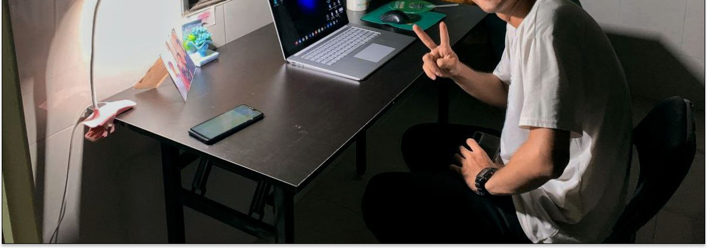
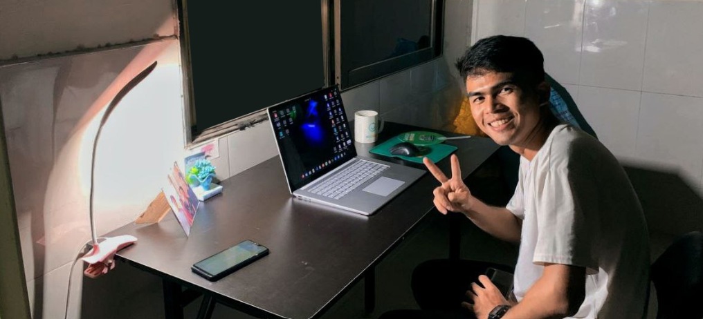
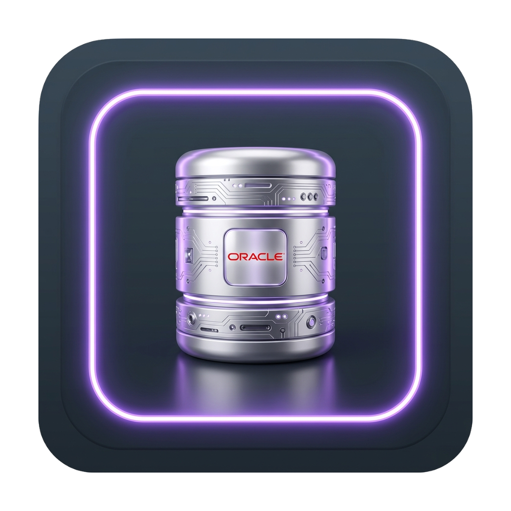

  

<!-- Social Links -->

  &nbsp;
  &nbsp;
  &nbsp;
  

  

---

## 🔮 About Me

<table border="0">
  <tr>
    <td width="65%" valign="top">
      
Hello! My name is <b>Sarath Orn (Rath KH)</b>. I am a 22-year-old Information Technology major and software developer currently living in Phnom Penh City (originally from Siem Reap province), Cambodia.

      
I pursued IT out of a genuine passion for building technology. My goal is to become a high-impact <b>Full-Stack Developer</b>, specializing in backend architectures, custom ERP systems, and modern web application development.

      <ul>
        <li>🏫 <b>Education:</b> Majoring in Information Technology in Phnom Penh City.</li>
        <li>💼 <b>Current focus:</b> ERP solutions (Odoo), full-stack web architectures (Java, Express.js, Laravel), and databases (Oracle DB, Firebase, PostgreSQL).</li>
        <li>💡 <b>Interests:</b> UI/UX design (Figma), agile project tracking (Jira), build optimization (Vite), and cloud deployments (Vercel).</li>
        <li>⚡ <b>Fun Fact:</b> I turn ideas into automated scripts before they have a chance to become manual work.</li>
      </ul>
    </td>
    <td width="35%" align="center" valign="middle">
      
    </td>
  </tr>
</table>

---

## 🛠️ Tech Universe

  
   
  
   
  &nbsp;

  &nbsp;
  &nbsp;
  

---

## 🏆 GitHub Milestones

  

---

## 📊 Live Metrics & Activity

  <table border="0">
    <tr>
      <td align="center">
        
      </td>
      <td align="center">
        
      </td>
    </tr>
    <tr>
      <td colspan="2" align="center">
         
        
      </td>
    </tr>
  </table>

---

## 🦖 Offline Dino Game

  

---

  <i>Design crafted with ✨ and 💜 by Antigravity</i>

